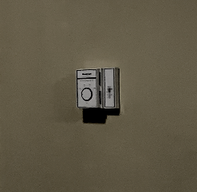

## Monitor
Open the monitor by clicking it in the middle of the screen. Close it by pressing S or Esc. Click on the different available cameras to switch.\

## Power Switch
Toggle the power with the switch near the middle of the room. Note that the room gets colder while the power's out.\

## Mohamed
On the leftmost camera, there is an option to play the audio. Use this toggle to increase or decrease the noise level so that it's not too loud or too quiet. If it is quiet for too long, Mohamed will kill you.
If, at any point, two or more extra sounds play at the same time, Mohamed will kill you.\

## Hashir
Every hour, Hashir's alarm will ring but he won't wake up. React fast before the sound triggers Mohamed. Hashir sometimes appears in the room, hungry. Quickly type "food?" with your keyboard to send him away.\

## Don
Don will randomly appear in his camera playing games on his computer. If he rages, he will start screaming. To get him off his computer, cut the power with the switch near the left-center of the main room.\

## Riyyan
Riyyan does not like sleeping in the cold. The place gets colder while the power is off. Make sure not to cool the place too much.\

## Pramit
Pramit approaches you from the hallway, visible by the cameras. After reaching your door, he will knock and attempt to sneak up on you. Quickly stare at him when he arrives in order to send him back.\

## Zaid
Zaid is visible in the cameras. He starts in the leftmost room and makes his way towards the right. Once he sneaks up on you, he baits you with a knocking sound. Do not turn to reveal your face or else he will kill you.\

